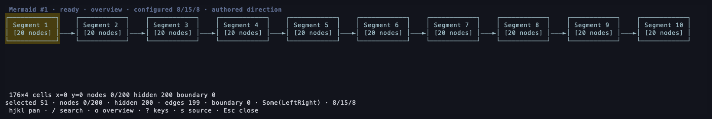
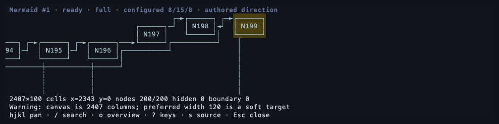
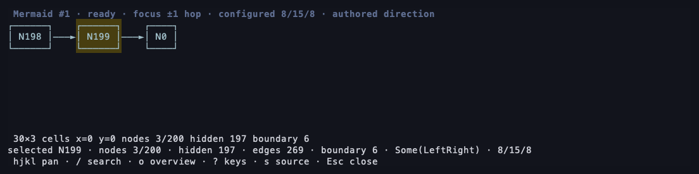
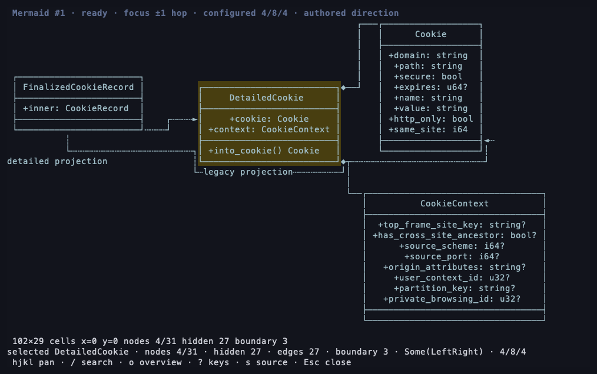

# Leaf Mermaid prototype: terminal captures

Demo assets for [RivoLink/leaf#258](https://github.com/RivoLink/leaf/issues/258).
This separate, assets-only branch keeps generated images out of the implementation PRs.

- [Leaf prototype PR](https://github.com/teng-lin/leaf/pull/1), commit `10e8e9175ae225d37d64441c4592439edffe6c9f`.
- [mmdflux companion PR](https://github.com/teng-lin/mmdflux/pull/1), commit `16cb0ca6876cc458318c59da63a9f56399e0c8c5`.
- Leaf release binary SHA-256: `a0ac0ce6897bb859d8af53b7c4af20695b99decdb02f4262b1388bd1d3f7a773`.

These are real isolated tmux pane captures from the release executable. PNGs paint
the captured cells and colors with `scripts/render-terminal-capture.swift`; they
do not regenerate the diagrams with a different renderer. Terminal dimensions
were chosen for compact examples; full diagrams still require navigation.

## Group overview: 200 original nodes

`flowchart_large.md`, terminal 180 × 14, spacing 8/15/8. Open with `v`, then `o`.
Ten original groups represent twenty nodes each. The status discloses all 200
collapsed nodes. Space expands the selected group.

## Search and focus in a dense 200-node graph

`dense-cyclic-200.md`, terminal 120 × 14, spacing 8/15/8. Open with `v`, search
for `N199`, then press Enter. The full canvas retains all 200 nodes; this is a
panned viewport, not a fit-to-screen export.

Press `f` for the one-hop incoming/outgoing neighborhood. The footer explicitly
reports the three visible nodes, 197 hidden nodes, and six omitted boundary edges.

## Class neighborhood with members retained

`rookie-classes.md`, terminal 110 × 34, spacing 4/8/4. Search for `DetailedCookie`
and press `f`. Four of the original 31 classes are shown with their member text;
hidden nodes and boundary relationships are disclosed. `a` toggles class members.

