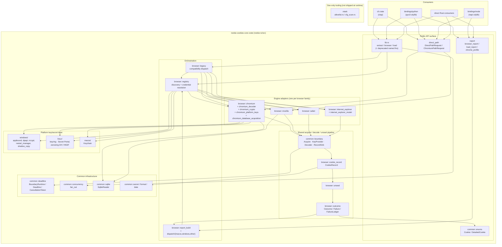

# rookie-architecture

DOCUMENT-RESTORE-SENTINEL

```mermaid
flowchart TB
  subgraph Consumers
    CLI["cli crate\n(clap)"]
    PY["bindings/python\n(pyo3 cdylib)"]
    NODE["bindings/node\n(napi cdylib)"]
    RUSTC["direct Rust consumers"]
  end

  subgraph Core["rookie-cookies core crate (rookie-rs/src)"]
    subgraph PublicAPI["Public API surface"]
      LIB["lib.rs\nextract / browser / load\n(+ deprecated named fns)"]
      DIRECT["direct_path\nDirectPathRequest / ChromiumPathRequest"]
      REPORTAPI["report\nbrowser_report / load_report / chrome_profile"]
      ENUMS["common::enums\nCookie / DetailedCookie"]
    end

    subgraph Orchestration
      REGISTRY["browser::registry\ndiscovery + credential resolution"]
      LEGACY["browser::legacy\ncompatibility dispatch"]
      REPORTBUILD["browser::report_build\n+ dispatch/{macos,windows,other}"]
    end

    subgraph Engines["Engine adapters (one per browser family)"]
      CHROMIUM["browser::chromium\n+ chromium_decoder\n+ chromium_crypto\n+ chromium_platform_keys\n+ chromium_database_acquisition"]
      MOZILLA["browser::mozilla"]
      SAFARI["browser::safari"]
      IE["browser::internet_explorer\n+ internet_explorer_model"]
    end

    subgraph Pipeline["Shared acquire / decode / unseal pipeline"]
      TRAITS["common::boundary\nAcquire · KeyProvider · Decoder · RecordSink"]
      RECORD["browser::cookie_record\nCookieRecord"]
      UNSEAL["browser::unseal"]
      OUTCOME["browser::outcome\nOutcome / Failure / FailureLedger"]
    end

    subgraph Infra["Common infrastructure"]
      DEADLINE["common::deadline\nBoundaryRuntime / Deadline / CancellationToken"]
      CONCURRENCY["common::concurrency\nfan_out"]
      SQLITE["common::sqlite\nSqliteReader"]
      SECRET["common::secret / format / date"]
    end

    subgraph PlatformOS["Platform key/secret layer"]
      WIN["windows/\nappbound, dpapi, ncrypt,\nrestart_manager, shadow_copy"]
      LINUXMOD["linux/\nkeyring · Secret Portal,\nzeroizing DH / HKDF"]
      MACMOD["macos/\nKeychain"]
    end
  end

  subgraph Dev["Dev-only tooling (not shipped at runtime)"]
    XTASK["xtask\nallowlist.rs / cfg_scan.rs"]
  end

  CLI --> LIB
  CLI --> DIRECT
  PY --> LIB
  PY --> DIRECT
  PY --> REPORTAPI
  NODE --> DIRECT
  NODE --> REPORTAPI
  RUSTC --> LIB
  RUSTC --> DIRECT
  RUSTC --> REPORTAPI

  LIB --> REGISTRY
  LIB --> LEGACY
  LIB --> CONCURRENCY
  DIRECT --> CHROMIUM
  DIRECT --> MOZILLA
  REPORTAPI --> REPORTBUILD
  LEGACY --> REGISTRY
  REPORTBUILD --> REGISTRY

  REGISTRY --> CHROMIUM
  REGISTRY --> MOZILLA
  REGISTRY --> SAFARI
  REGISTRY --> IE
  LEGACY --> CHROMIUM
  LEGACY --> MOZILLA
  LEGACY --> SAFARI
  LEGACY --> IE

  CHROMIUM --> TRAITS
  MOZILLA --> TRAITS
  SAFARI --> TRAITS
  IE --> TRAITS
  TRAITS --> RECORD
  RECORD --> UNSEAL
  UNSEAL --> OUTCOME
  OUTCOME --> ENUMS
  OUTCOME --> REPORTBUILD

  CHROMIUM --> WIN
  CHROMIUM --> LINUXMOD
  CHROMIUM --> MACMOD
  REGISTRY --> WIN
  REGISTRY --> LINUXMOD
  REGISTRY --> MACMOD

  TRAITS --> DEADLINE
  CHROMIUM --> SQLITE
  MOZILLA --> SQLITE
  RECORD --> SECRET
```

END-SENTINEL
