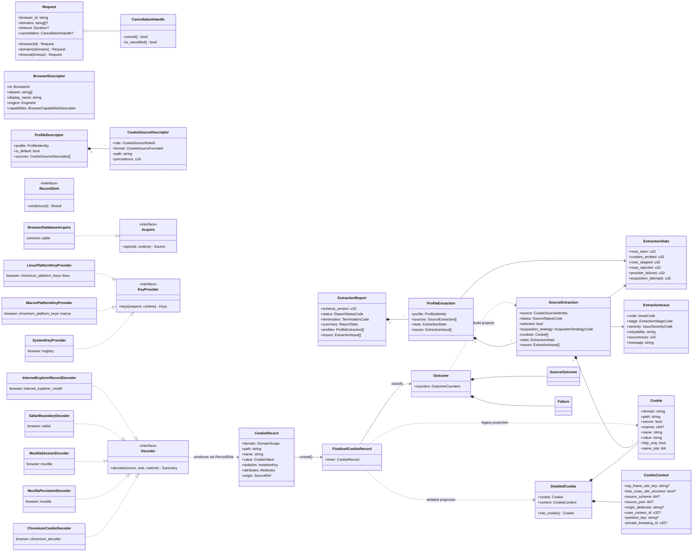

# rookie-classes

DOCUMENT-RESTORE-SENTINEL

```mermaid
classDiagram
  direction LR

  class Request {
    +browser_id: string
    +domains: string[]?
    +timeout: Duration?
    +cancellation: CancellationHandle?
    +browser(id) Request
    +domains(domains) Request
    +timeout(timeout) Request
  }
  class CancellationHandle {
    +cancel() bool
    +is_cancelled() bool
  }
  Request o-- CancellationHandle

  class Cookie {
    +domain: string
    +path: string
    +secure: bool
    +expires: u64?
    +name: string
    +value: string
    +http_only: bool
    +same_site: i64
  }
  class CookieContext {
    +top_frame_site_key: string?
    +has_cross_site_ancestor: bool?
    +source_scheme: i64?
    +source_port: i64?
    +origin_attributes: string?
    +user_context_id: u32?
    +partition_key: string?
    +private_browsing_id: u32?
  }
  class DetailedCookie {
    +cookie: Cookie
    +context: CookieContext
    +into_cookie() Cookie
  }
  DetailedCookie *-- Cookie
  DetailedCookie *-- CookieContext

  class ExtractionReport {
    +schema_version: u32
    +status: ReportStatusCode
    +termination: TerminationCode
    +summary: ReportStats
    +profiles: ProfileExtraction[]
    +issues: ExtractionIssue[]
  }
  class ProfileExtraction {
    +profile: ProfileIdentity
    +sources: SourceExtraction[]
    +stats: ExtractionStats
    +issues: ExtractionIssue[]
  }
  class SourceExtraction {
    +source: CookieSourceIdentity
    +status: SourceStatusCode
    +selected: bool
    +acquisition_strategy: AcquisitionStrategyCode
    +cookies: Cookie[]
    +stats: ExtractionStats
    +issues: ExtractionIssue[]
  }
  class ExtractionStats {
    +rows_seen: u32
    +cookies_emitted: u32
    +rows_skipped: u32
    +rows_rejected: u32
    +provider_failures: u32
    +acquisition_attempts: u32
  }
  class ExtractionIssue {
    +code: IssueCode
    +stage: ExtractionStageCode
    +severity: IssueSeverityCode
    +retryability: string
    +occurrences: u32
    +message: string
  }
  ExtractionReport "1" *-- "*" ProfileExtraction
  ProfileExtraction "1" *-- "*" SourceExtraction
  SourceExtraction "1" *-- "*" Cookie
  SourceExtraction --> ExtractionStats
  SourceExtraction --> ExtractionIssue
  ProfileExtraction --> ExtractionStats

  class BrowserDescriptor {
    +id: BrowserId
    +aliases: string[]
    +display_name: string
    +engine: EngineId
    +capabilities: BrowserCapabilitiesDescriptor
  }
  class ProfileDescriptor {
    +profile: ProfileIdentity
    +is_default: bool
    +sources: CookieSourceDescriptor[]
  }
  class CookieSourceDescriptor {
    +role: CookieSourceRoleId
    +format: CookieSourceFormatId
    +path: string
    +precedence: u16
  }
  ProfileDescriptor "1" *-- "*" CookieSourceDescriptor

  class Acquire {
    <<interface>>
    +open(id, runtime) Source
  }
  class KeyProvider {
    <<interface>>
    +keys(request, runtime) Keys
  }
  class Decoder {
    <<interface>>
    +decode(source, sink, runtime) Summary
  }
  class RecordSink {
    <<interface>>
    +emit(record) Result
  }

  class BrowserDatabaseAcquire {
    common::sqlite
  }
  BrowserDatabaseAcquire ..|> Acquire

  class ChromiumCookieDecoder {
    browser::chromium_decoder
  }
  class MozillaPersistentDecoder {
    browser::mozilla
  }
  class MozillaSessionDecoder {
    browser::mozilla
  }
  class SafariBoundaryDecoder {
    browser::safari
  }
  class InternetExplorerRecordDecoder {
    browser::internet_explorer_model
  }
  ChromiumCookieDecoder ..|> Decoder
  MozillaPersistentDecoder ..|> Decoder
  MozillaSessionDecoder ..|> Decoder
  SafariBoundaryDecoder ..|> Decoder
  InternetExplorerRecordDecoder ..|> Decoder

  class SystemKeyProvider {
    browser::registry
  }
  class MacosPlatformKeyProvider {
    browser::chromium_platform_keys::macos
  }
  class LinuxPlatformKeyProvider {
    browser::chromium_platform_keys::linux
  }
  SystemKeyProvider ..|> KeyProvider
  MacosPlatformKeyProvider ..|> KeyProvider
  LinuxPlatformKeyProvider ..|> KeyProvider

  class CookieRecord {
    +domain: DomainScope
    +path: string
    +name: string
    +value: CookieValue
    +isolation: IsolationKey
    +attributes: Attributes
    +origin: SourceRef
  }
  class FinalizedCookieRecord {
    +inner: CookieRecord
  }
  class Outcome {
    +counters: OutcomeCounters
  }
  class SourceOutcome
  class Failure

  Decoder ..> CookieRecord : produces via RecordSink
  CookieRecord --> FinalizedCookieRecord : unseal()
  FinalizedCookieRecord --> Outcome : classify
  Outcome *-- SourceOutcome
  Outcome *-- Failure
  Outcome ..> SourceExtraction : report_build projects
  FinalizedCookieRecord ..> Cookie : legacy projection
  FinalizedCookieRecord ..> DetailedCookie : detailed projection
```

END-SENTINEL
